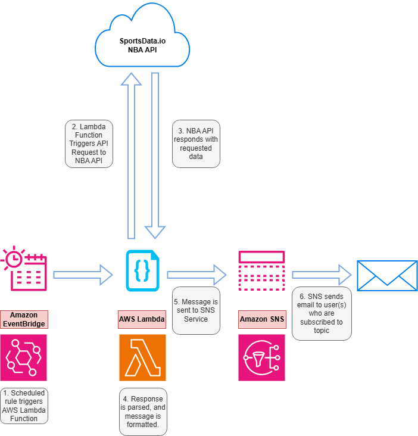

# NBA Game Day Notifications & Alerts
## Project Overview
This project is part of day two of the 30 Day DevOps Challenge. The code for this project was cloned from the following repository: https://github.com/ifeanyiro9/game-day-notifications/blob/main/README.md\
The project itself sends NBA score updates on a schedule via SMS/email. The project uses Amazon SNS, Amazon Lambda, Python, Amazon EventBridge and the SportsData.io NBA API.
## Prerequisites
In order to complete this project the following are required:
- Sportsdata.io NBA API Key
- AWS Account
## Technocal Architecture

## Technologies
Technologies used in this project:
- **Cloud Provider:** AWS
- **Core Services:** SNS, Lambda, EventBridge
- **External API:** Sportsdata.io NBA API
- **Programming Language:** Python (Lambda Function)
- **IAM Security:** Policies for Lambda, SNS, and EventBridge
## Project Flow
Amazon EventBridge is used to schedule an event that is triggered every two hours from 9:00AM to 2:00AM the following day.\
The EventBridge rule triggers the gameday Lambda function.\
The gameday Lambda function once triggered, creates an API request to the sportsdata.io NBA API to retrieve all games that are scheduled on the current day. This response is then parsed and formatted to display games that are scheduled for the current day, in progress and games that have gone final.\
After formatting the message, the message is then sent to the SNS Service. The message is then sent to users that are subscribed to the SNS Topic. For testing, I used email to verify that messages could be delivered successfully.\